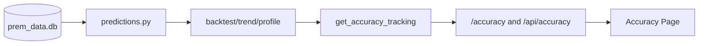

# Accuracy Tracking Build Guide (Before Phase 2)

This document explains exactly what to build for accuracy tracking, where each piece should live, and why each part is needed.

Goal: make `get_accuracy_tracking()` in your service layer possible and trustworthy before moving to Phase 2 (routes/frontend integration).

---

## 1) What Accuracy Tracking Means in This Project

Your model predicts future outcomes (points, positions, title/top4 odds).  
Accuracy tracking compares those past predictions to what actually happened.

Without this, your dashboard can show probabilities, but cannot answer:
- "How good is this model?"
- "Is it improving over time?"
- "Which teams are harder to predict?"

---

## 2) What To Build in `predictions.py`

You currently have simulation and scenario logic.  
You need to add **evaluation/backtesting** functions to the same engine module.

Implement these functions in:
- [`C:/Users/uzeyr/PremierLeaguePredictor/services/predictions.py`](C:/Users/uzeyr/PremierLeaguePredictor/services/predictions.py)

### Function A: `backtest_model(season: str, at_gameweek: int) -> dict`
**Why needed:** one snapshot score of model quality.

**Should do:**
1. Load historical standings/results for `season`.
2. Pretend current date is `at_gameweek`.
3. Generate predictions from that point.
4. Compare to actual final table.
5. Return key metrics:
   - `mae_points`
   - `position_accuracy_pm1`
   - `top4_hit_count`
   - `title_winner_correct`
   - optional team-by-team breakdown

**Contract (recommended):**
```python
{
  "season": 2024,
  "at_gameweek": 25,
  "team_count": 20,
  "metrics": {
    "mae_points": 5.15,
    "position_accuracy_pm1": 0.60,
    "top4_hit_count": 3,
    "title_winner_correct": True
  },
  "predicted_top4": ["Liverpool", "Arsenal", "Man City", "Chelsea"],
  "actual_top4": ["Liverpool", "Arsenal", "Man City", "Chelsea"],
  "predicted_champion": "Liverpool",
  "actual_champion": "Liverpool"
}
```

### Function B: `get_accuracy_trend(season: str, checkpoints: list[int]) -> list[dict]`
**Why needed:** trend graph for accuracy page.

**Should do:**
1. Loop over checkpoint gameweeks (example: `[10, 20, 30]`).
2. Call `backtest_model()` for each checkpoint.
3. Return list sorted by gameweek:
   - `gameweek`
   - `mae_points`
   - `position_accuracy_pm1`
   - `top4_hit_count`

**Contract (recommended):**
```python
[
  {
    "season": 2024,
    "gameweek": 10,
    "mae_points": 8.10,
    "position_accuracy_pm1": 0.40,
    "top4_hit_count": 2,
    "title_winner_correct": False
  },
  {
    "season": 2024,
    "gameweek": 20,
    "mae_points": 6.25,
    "position_accuracy_pm1": 0.50,
    "top4_hit_count": 3,
    "title_winner_correct": True
  },
  {
    "season": 2024,
    "gameweek": 30,
    "mae_points": 4.95,
    "position_accuracy_pm1": 0.65,
    "top4_hit_count": 3,
    "title_winner_correct": True
  }
]
```

### Function C: `get_team_error_profile(season: str, at_gameweek: int) -> list[dict]`
**Why needed:** explainability and diagnostics.

**Should do:**
1. Compare predicted vs actual points/position per team.
2. Return per-team error rows:
   - `team`
   - `predicted_points`
   - `actual_points`
   - `points_error`
   - `predicted_position`
   - `actual_position`
   - `position_error`

**Contract (recommended):**
```python
[
  {
    "season": 2024,
    "gameweek": 25,
    "team": "Arsenal",
    "predicted_points": 76,
    "actual_points": 74,
    "points_error": 2,
    "predicted_position": 2,
    "actual_position": 2,
    "position_error": 0
  },
  {
    "season": 2024,
    "gameweek": 25,
    "team": "Chelsea",
    "predicted_points": 63,
    "actual_points": 69,
    "points_error": 6,
    "predicted_position": 6,
    "actual_position": 4,
    "position_error": 2
  }
]
```

### Function D: `get_data_freshness_metadata() -> dict`
**Why needed:** trust and transparency.

**Should do:**
1. Report latest match date / latest gameweek present in DB.
2. Return:
   - `data_as_of_date`
   - `data_as_of_gameweek`

**Contract (recommended):**
```python
{
  "season": 2024,
  "data_as_of_date": "2025-05-25",
  "data_as_of_gameweek": 38,
  "played_matches": 380
}
```

---

## 3) Data Requirements (What Must Exist in DB)

Your engine needs enough historical data to backtest.

Minimum required tables (or equivalent):
- current and historical match results (with gameweek/date)
- standings snapshots OR enough match data to reconstruct standings

Recommended fields:
- `season`
- `gameweek`
- `match_date`
- `home_team`, `away_team`
- `home_score`, `away_score`
- `played`

If historical snapshots do not exist, create standings from match results inside backtest logic.

---

## 4) Metric Definitions (Use These Exactly)

Keep metric definitions stable so dashboard numbers are comparable over time.

- **MAE (points):**  
  Mean of `abs(predicted_points - actual_points)` across all teams.

- **Position accuracy (+/-1):**  
  Fraction of teams where `abs(pred_pos - actual_pos) <= 1`.

- **Top4 hit count:**  
  `len(pred_top4 ∩ actual_top4)` (0 to 4).

- **Title winner correct:**  
  `predicted_champion == actual_champion`.

---

## 5) Where This Connects in System Design

Accuracy tracking belongs in the engine first, then is exposed by service.



Why this order:
1. Engine computes truth.
2. Service packages response contracts.
3. Routes/frontend only display.

---

## 6) Output Contract for Service Consumption

Your engine should produce shapes the service can directly use.

Recommended `get_accuracy_tracking()` payload target:

```python
{
  "meta": {
    "generated_at": "...",
    "data_as_of_date": "...",
    "data_as_of_gameweek": 33
  },
  "latest": {
    "gameweek": 33,
    "mae_points": 4.7,
    "position_accuracy_pm1": 0.65,
    "top4_hit_count": 3,
    "title_winner_correct": True
  },
  "trend": [
    {"gameweek": 10, "mae_points": 8.1, "position_accuracy_pm1": 0.40, "top4_hit_count": 2},
    {"gameweek": 20, "mae_points": 6.2, "position_accuracy_pm1": 0.52, "top4_hit_count": 3},
    {"gameweek": 30, "mae_points": 5.1, "position_accuracy_pm1": 0.61, "top4_hit_count": 3}
  ],
  "team_error_profile": [
    {"team": "Arsenal", "predicted_points": 85, "actual_points": 83, "points_error": 2}
  ]
}
```

### 6.1 Suggested Service-Level Method Contracts

Use these return contracts so your route layer can stay simple.

#### `PredictionService.get_accuracy_tracking(season: int, at_gameweek: int, checkpoints: list[int]) -> dict`
```python
{
  "meta": {
    "generated_at": "2026-04-29T17:05:00Z",
    "season": 2024,
    "at_gameweek": 25
  },
  "latest_backtest": {...backtest_model payload...},
  "trend": [...get_accuracy_trend payload...],
  "team_error_profile": [...get_team_error_profile payload...],
  "freshness": {...get_data_freshness_metadata payload...}
}
```

#### `PredictionService.get_accuracy_latest(season: int, at_gameweek: int) -> dict` (optional helper)
```python
{
  "season": 2024,
  "at_gameweek": 25,
  "mae_points": 5.15,
  "position_accuracy_pm1": 0.60,
  "top4_hit_count": 3,
  "title_winner_correct": True
}
```

---

## 7) Build Order (Do This Sequence)

1. Add `backtest_model()` to `predictions.py`.
2. Validate metrics on one known season.
3. Add `get_accuracy_trend()` using repeated backtests.
4. Add `get_team_error_profile()` for diagnostics.
5. Add `get_data_freshness_metadata()`.
6. Only then wire `PredictionService.get_accuracy_tracking()`.

---

## 8) Common Pitfalls To Avoid

- Mixing seasons accidentally when querying DB.
- Using today/current table instead of historical checkpoint table in backtests.
- Changing metric definitions midstream (breaks trend comparability).
- Returning inconsistent key names between calls.
- Building route/UI before engine outputs are stable.

---

## 9) Definition of Done (Before Phase 2)

You are ready to move on when:
- Backtest runs for at least one historical season without manual fixes.
- Metrics return in stable contract format.
- Trend output supports charting directly.
- Accuracy payload can be consumed by service without additional data munging.

