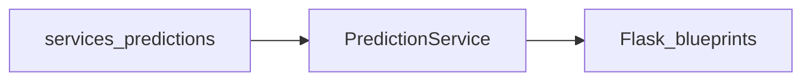

# Backend done checklist (pre-routes / pre-frontend)

Use this document as a **single ordered gate**: work top to bottom, tick each spec when the **WHAT** is true in code, then run the **go/no-go** block at the end. Scope is **final fixes** to the existing engine, service layer, and minimal contract tests only—no new features, no new dependencies, no UI.

**Done criteria (summary):** Engine metrics and scenario helpers match their contracts; `PredictionService` returns JSON-serializable payloads; `simulate_season` and `simulate_season_scenario` expose the same probability keys where the service expects them; the four pytest contracts below pass.

---

## Out of scope (do not block on these for this checklist)

- Configurable DB path / multi-season productization (you may hardcode one season for now).
- Caching, persistence of backtest runs, or job queues.
- New API routes, templates, or frontend contracts.
- Refactoring `predictions.py` to lazy-load the database at import time.
- New evaluation metrics beyond those already implied by your accuracy doc and current return dicts.

---

## A. Engine fixes — [`services/predictions.py`](../services/predictions.py)

### A1. `backtest_model` — SQL must use `season`

| | |
|---|---|
| **WHY** | If `params` is always `("2024",)` while the function accepts `season`, calling `backtest_model("2025", …)` still evaluates 2024—silent wrong backtests. |
| **WHAT** | `pd.read_sql_query(..., params=(season,))` (or equivalent) so the loaded match rows match the requested season string. |
| **HOW** | At the query that loads `match_data`, replace the hardcoded tuple with `params=(season,)`. Optionally align `get_team_error_profile` / `get_accuracy_trend` inner calls to pass `season` into `backtest_model(season, …)` instead of a literal `"2024"`. |
| **RESOURCE** | [pandas.read_sql_query](https://pandas.pydata.org/docs/reference/api/pandas.read_sql_query.html) — parameter binding for SQL. |

---

### A2. `backtest_model` — `position_accuracy_pm1` (not points ±1)

| | |
|---|---|
| **WHY** | The current loop counts teams where **predicted vs actual points** differ by ≤1, which is a *points* tolerance, not *league rank* within ±1. It also uses `pred[team, "points"]` (invalid for a normal indexed frame) and prints every iteration. |
| **WHAT** | One scalar in `metrics`: **fraction of teams** (or count/20) for which \(\lvert \text{rank}_\text{pred} - \text{rank}_\text{true} \rvert \le 1\), where ranks come from sorting final **points** (and tie-breakers if you already have columns in the table). Prefer the key name `position_accuracy_pm1` in the returned `metrics` dict for alignment with docs and tests. |
| **HOW** | After aligning `pred` / `true` on `team`, sort each side by points (desc) and optional GD/GF; assign integer rank 1..n per team. For each team, `abs(r_pred - r_true) <= 1`; aggregate as mean or count/n. Use `.loc[team, "points"]` only where you need points. Remove debug `print` calls. |
| **RESOURCE** | [pandas.DataFrame.rank](https://pandas.pydata.org/docs/reference/api/pandas.DataFrame.rank.html) — explicit ranking; [sklearn.metrics.mean_absolute_error](https://scikit-learn.org/stable/modules/generated/sklearn.metrics.mean_absolute_error.html) — you already use MAE correctly for points after `align`. |

**Current code reference (to replace):**

```961:964:services/predictions.py
    for team, row in pred.iterrows():
        if abs(int(pred[team, "points"]) - int(true[team, "points"])) <=1:
            print(abs(int(pred[team, "points"]) - int(true[team, "points"])))
            pm1 += 1
```

---

### A3. `backtest_model` — `top4_hit_count` as set intersection

| | |
|---|---|
| **WHY** | `1 - len(set(pred) - set(true))/4` is not the size of overlap; it is hard to interpret and can disagree with the UI definition “how many of the predicted top 4 were actually top 4”. |
| **WHAT** | Integer in **0..4**: \(\lvert \text{top4}_\text{pred} \cap \text{top4}_\text{true} \rvert\). |
| **HOW** | `top4_hit_count = len(set(top_4_pred) & set(top_4_true))`. Ensure `top_4_true` is derived from the **same rule** as `top_4_pred` (e.g. top four by final points / table order). |
| **RESOURCE** | [Python sets — operations](https://docs.python.org/3/tutorial/datastructures.html#sets) — intersection `&`. |

**Current code reference:**

```967:969:services/predictions.py
    top_4_pred = list(league_points_predicted_2024.index[:4])
    top_4_true = league_table_2024_true["team"].head(4).values
    top4_hit_count = 1- len( set(top_4_pred) - set(top_4_true))/4
```

---

### A4. `get_team_error_profile` — `predicted_position` from rank by points

| | |
|---|---|
| **WHY** | `league_points_predicted_2024.index.get_loc(team) + 1` is **row order** in the frame, not “position in the league if sorted by predicted points”. |
| **WHAT** | `predicted_position` = 1-based rank after sorting predicted table by `points` (then tie-breakers consistent with the rest of your engine). `actual_position` should use the same rule on the true final table. |
| **HOW** | Build a series `pred_rank = league_points_predicted_2024["points"].rank(method="min", ascending=False)` (or `sort_values` then `reset_index` and map position), then `int(pred_rank.loc[team])`. Recompute `position_error` from those ranks. |
| **RESOURCE** | [pandas.sort_values](https://pandas.pydata.org/docs/reference/api/pandas.DataFrame.sort_values.html) + [rank](https://pandas.pydata.org/docs/reference/api/pandas.DataFrame.rank.html). |

**Current code reference:**

```1100:1102:services/predictions.py
            "predicted_position": league_points_predicted_2024.index.get_loc(team) + 1,
            "actual_position": league_points_true_2024.index.get_loc(team) + 1,
            "position_error": abs(league_points_predicted_2024.index.get_loc(team) - league_points_true_2024.index.get_loc(team))
```

---

### A5. `compare_scenario` — no shadowing; correct sort pipeline

| | |
|---|---|
| **WHY** | The loop reassigns `baseline_prob` / `scenario_prob` from dicts to scalars, so after the first team the outer dict is lost and the loop is wrong. `sort_values` is called with a Series instead of a column name; `.drop` / `reset_index` results are not assigned back to `df_result`. |
| **WHAT** | A `DataFrame` with one row per team, sorted descending by absolute probability change, columns `team`, `baseline_prob`, `scenario_prob`, `change`, `change_pct` (and optionally drop helper `abs_change` after sorting). |
| **HOW** | Use distinct names in the loop (`baseline_dict`, `scenario_dict`, then `b = baseline_dict[team]`, `s = scenario_dict[team]`). Then: `df_result = df_result.sort_values("abs_change", ascending=False).drop(columns="abs_change").reset_index(drop=True)` (adjust if you keep `abs_change`). |
| **RESOURCE** | [pandas.DataFrame.sort_values](https://pandas.pydata.org/docs/reference/api/pandas.DataFrame.sort_values.html). |

**Current code reference:**

```566:587:services/predictions.py
    for team in baseline_prob.keys():
        baseline_prob = baseline_prob[team]
        scenario_prob = scenario_prob[team]
        change = scenario_prob - baseline_prob

        comparison.append(
            {
                'team': team,
                'baseline_prob': baseline_prob,
                'scenario_prob': scenario_prob,
                'change': change,
                "change_pct": change * 100
            }

        )

    df_result = pd.DataFrame(comparison)
    df_result['abs_change'] = df_result['change'].abs()
    df_result.sort_values(df_result['abs_change'], ascending= False).drop('abs_change')
    df_result.reset_index(drop = True)

    return df_result
```

---

### A6. `get_points_distribution(team, simulation_result)` — thin wrapper

| | |
|---|---|
| **WHY** | [`services/pl_predictor_cli.py`](../services/pl_predictor_cli.py) imports `get_points_distribution`; the service / CLI contract expects this name. Calling `get_team_points_distribution(team, sims)` with the **whole** sim dict is the wrong second argument (see existing `get_team_points_distribution` signature). |
| **WHAT** | `get_points_distribution(team, simulation_result) -> dict` with keys `min`, `max`, `median`, `p5`, `p95`, `points_distribution`—delegating to existing `get_team_points_distribution(team, simulation_result["points_distribution"][team])`. |
| **HOW** | Add a 3–5 line function next to `get_team_points_distribution`; no new dependencies. |
| **RESOURCE** | Same module patterns you already use in `get_team_points_distribution` ([NumPy percentiles](https://numpy.org/doc/stable/reference/generated/numpy.percentile.html)). |

---

### A7. `simulate_season_scenario` — include `top_2_probabilities`

| | |
|---|---|
| **WHY** | `simulate_season` returns `top_2_probabilities`; `simulate_season_scenario` does not. Any code path that treats scenario output like baseline season output will `KeyError` on `top_2_probabilities`. |
| **WHAT** | Return dict keys match `simulate_season`: at minimum add `top_2_probabilities` computed the same way (counter over sorted table index positions 0–1 each sim). |
| **HOW** | Mirror the `top_2_finishes` loop from `simulate_season` inside `simulate_season_scenario` and add the key to the returned dict. |
| **RESOURCE** | Internal consistency: compare return blocks in `simulate_season` vs `simulate_season_scenario` in the same file. |

**Return block reference (scenario path — missing key today):**

```440:446:services/predictions.py
    return {
        'title_probabilities': title_probs,
        'top_4_probabilities': top_4_probs,
        'relegation_probabilities': relegation_probs,
        'all_simulations': all_simulations,
        'points_distribution': points_distribution
    }
```

---

## B. Service layer fixes — [`services/prediction_service.py`](../services/prediction_service.py)

### B1. Imports — one repository, one predictions module, validators package path

| | |
|---|---|
| **WHY** | `from app import predictions` is redundant with `from services import predictions as pred` and breaks depending on how the app is started. `from validators import ...` fails unless `PYTHONPATH` exposes a top-level `validators` module. A duplicate `PredictionRepository` import from a loose `repository` module confused readers and could shadow the wrong symbol. |
| **WHAT** | Single import path for validators: `from services.validators import validate_fixture_override` (see [`services/validators.py`](../services/validators.py)). Remove `from app import predictions` and the duplicate repository import. |
| **HOW** | Delete unused imports; keep `from services.repository import PredictionRepository` once. |
| **RESOURCE** | [Python imports — packages](https://docs.python.org/3/reference/import.html#packages). |

**Import block (as applied — B1):**

```10:22:services/prediction_service.py
from dataclasses import dataclass
from typing import Any, TypedDict
from datetime import datetime

from models.contracts import DashboardSummary, TeamProbabilityRow
from services.repository import PredictionRepository
from services.simulation_config import SimulationConfig, DEFAULT_SIMULATION_CONFIG
from services.validators import validate_fixture_override

from services.predictions import get_team_probabilities, league_table, backtest_model, get_accuracy_trend
from services.predictions import simulate_season
from services.predictions import get_project_final_points
from services import predictions as pred
```

```28:46:services/validators.py
def validate_fixture_override(override: dict, valid_teams: set[str]) -> None:
```

---

### B2. `get_upcoming_fixtures` — iterate the DataFrame, not `DataFrame()`

| | |
|---|---|
| **WHY** | `fixture_df` is already a DataFrame; `fixture_df()` raises `TypeError: 'DataFrame' object is not callable`. |
| **WHAT** | `for _, match in fixture_df.iterrows():` building the same `entry` dict shape as today. |
| **HOW** | Remove the parentheses after `fixture_df`. |
| **RESOURCE** | [pandas.DataFrame.iterrows](https://pandas.pydata.org/docs/reference/api/pandas.DataFrame.iterrows.html). |

**Current code reference:**

```172:175:services/prediction_service.py
        fixture_df = pred.get_remaining_matches()
        payload = []

        for index, match in fixture_df().iterrows():
```

---

### B3. `get_accuracy_tracking` — JSON-serializable payload

| | |
|---|---|
| **WHY** | `"team_error_profile": { team_error_profile }` uses a **set literal** `{ x }`; when `x` is a list or dict, Python raises **TypeError: unhashable type**. `datetime` in `meta.generated_at` is not JSON-serializable by default. NumPy scalars in nested dicts can also break `json.dumps` / `jsonify`. |
| **WHAT** | Plain nesting: `"team_error_profile": team_error_profile` (list of dicts), `"freshness": freshness` (dict). `generated_at` as ISO string, e.g. `now.isoformat()`. |
| **HOW** | Remove the wrapping `{ ... }` around list/dict values; cast any numpy types with `float()` / `int()` at the boundary if needed. |
| **RESOURCE** | [Flask jsonify / JSON type notes](https://flask.palletsprojects.com/en/stable/api/#flask.json.jsonify); [Python set literals vs dict literals](https://docs.python.org/3/tutorial/datastructures.html#sets). |

**Current code reference:**

```312:325:services/prediction_service.py
        return {
            "meta": {
                "generated_at": now,
                "season": 2024,
                "at_gameweek": at_gameweek
            },
            "latest": latest,
            "trend": trend,
            "team_error_profile": {
                team_error_profile
            },
            "freshness": {
                freshness
            }
        }
```

---

### B4. `run_scenario` — valid teams column, scenario dict shape, comparison keys

| | |
|---|---|
| **WHY** | `league_table["teams"]` does not exist (column is `team`). `simulate_scenario` returns the **same top-level keys** as `simulate_season` (`title_probabilities`, etc.), not the per-team nested structure from `get_team_probabilities`. `compare_metric("title_probabilities")` does not match `baseline` / `scenario` keys (`"title"`, `"top4"`, …) → **KeyError**. |
| **WHAT** | Validation uses `set(league_table["team"])`. Baseline from `get_team_probabilities` stays as today **or** you normalize both baseline and scenario from the same key layout. Scenario side: map `scenario_raw["title_probabilities"]` to the same percentage dict shape as baseline `"title"`. `comparison` keys must match what `compare_metric` reads (`"title"`, `"top4"`, `"relegation"`, and `"top2"` if you expose it). |
| **HOW** | After `scenario_raw = pred.simulate_scenario(...)`, build `scenario["title"] = {t: round(scenario_raw["title_probabilities"][t]*100,1) ...}` for all teams; same for top4/top2/relegation. Change `compare_metric` calls to use `"title"`, `"top4"`, `"relegation"` (and `"top2"` if desired). |
| **RESOURCE** | [Defensive programming at boundaries](https://flask.palletsprojects.com/en/stable/patterns/apierrors/) — validate inputs before simulation. |

**Current code references:**

```201:202:services/prediction_service.py
        for scenario in overrides:
           validate_fixture_override(scenario,league_table["teams"])
```

```274:277:services/prediction_service.py
        comparison: dict[str, list[dict[str, Any]]] = {
            "title": compare_metric("title_probabilities"),
            "top_4": compare_metric("top_4_probabilities"),
            "relegation": compare_metric("relegation_probabilities"),
        }
```

---

### B5. `get_detailed_predictions` — confidence intervals use points distribution list

| | |
|---|---|
| **WHY** | Current line passes the entire `sims` dict into `get_team_points_distribution(team, sims)`; that function expects the **list** of points for one team (`simulation_result["points_distribution"][team]`). |
| **WHAT** | Second argument is `sims["points_distribution"][team]` (or use your new `get_points_distribution(team, sims)` wrapper for one place to maintain). |
| **HOW** | One-line fix in the loop that builds `confidence_intervals`. |
| **RESOURCE** | Same as A6 — match function signature in [`get_team_points_distribution`](../services/predictions.py). |

**Current code reference:**

```141:143:services/prediction_service.py
        confidence_intervals = []
        for team in league_table["team"]:
            dist = pred.get_team_points_distribution(team, sims)
```

---

## C. Contract tests — [`tests/test_prediction_service.py`](../tests/test_prediction_service.py)

Replace placeholders with **minimal** tests: assert **shape and ranges**, not golden numeric values (Monte Carlo noise).

### C1. `test_backtest_model_shape`

| | |
|---|---|
| **WHY** | Locks the API surface the accuracy page and `/api/accuracy` will consume. |
| **WHAT** | `result = backtest_model("2024", gw)` contains keys: `metrics.mae_points`, `metrics.position_accuracy_pm1` (or your final metric name—align with A2), `metrics.top4_hit_count`, `metrics.title_winner_correct`, `predicted_top4`, `actual_top4`, `predicted_champion`, `actual_champion`. |
| **HOW** | `pytest` + plain `assert "metrics" in result` and nested key checks. |
| **RESOURCE** | [pytest assert](https://docs.pytest.org/en/stable/how-to/assert.html). |

---

### C2. `test_backtest_model_metric_ranges`

| | |
|---|---|
| **WHY** | Catches nonsensical metrics without depending on simulation seed. |
| **WHAT** | `0 <= top4_hit_count <= 4`; `0 <= position_accuracy_pm1 <= 1` (if expressed as fraction); `mae_points >= 0` and finite. |
| **HOW** | `assert math.isfinite(result["metrics"]["mae_points"])`, etc. |
| **RESOURCE** | [math.isfinite](https://docs.python.org/3/library/math.html#math.isfinite). |

---

### C3. `test_get_accuracy_tracking_is_json_safe`

| | |
|---|---|
| **WHY** | Exactly the failure mode from B3 (`TypeError` / non-serializable types). |
| **WHAT** | `json.dumps(service.get_accuracy_tracking("2024", 38, [10, 20, 30, 38]))` succeeds (optionally with a `default=str` only if you deliberately allow nonstandard types—prefer fixing types at source). |
| **HOW** | Construct `PredictionService` with a test double repository if required by `__init__`; otherwise patch. |
| **RESOURCE** | [json.dumps](https://docs.python.org/3/library/json.html#json.dumps). |

---

### C4. `test_run_scenario_keys_match_baseline`

| | |
|---|---|
| **WHY** | Ensures B4 wiring stays aligned: same team keys in baseline and scenario maps; `comparison["title"]` rows contain `baseline_prob`, `scenario_prob`, `change`. |
| **WHAT** | For empty `overrides` or one valid override, no `KeyError`; team sets match between `baseline["title"]` and `scenario["title"]`. |
| **HOW** | Call `run_scenario([], n, seed=0)` or one trivial override that passes validation. |
| **RESOURCE** | [pytest.raises](https://docs.pytest.org/en/stable/reference/reference.html#pytest.raises) for negative tests separately. |

---

## D. Reference links (best practices, grouped)

| Topic | Link |
|-------|------|
| Aligning / merging tables on keys | [pandas merging](https://pandas.pydata.org/docs/user_guide/merging.html) |
| Regression metrics (MAE) | [sklearn.metrics.mean_absolute_error](https://scikit-learn.org/stable/modules/generated/sklearn.metrics.mean_absolute_error.html) |
| Ranking & sorting for “position” | [pandas.DataFrame.rank](https://pandas.pydata.org/docs/reference/api/pandas.DataFrame.rank.html) |
| Set operations (top-4 overlap) | [Python sets](https://docs.python.org/3/tutorial/datastructures.html#sets) |
| JSON / API payloads | [Flask jsonify](https://flask.palletsprojects.com/en/stable/api/#flask.json.jsonify) |
| Contract tests | [pytest how-to asserts](https://docs.pytest.org/en/stable/how-to/assert.html) |

---

## E. Go / no-go checklist (tick all before routes + frontend)

- [ ] **A1** — `backtest_model` SQL uses `season`; trend helper uses `season` when calling backtest.
- [ ] **A2** — Position ±1 metric is rank-based; no invalid indexing; no debug prints in hot paths.
- [ ] **A3** — `top4_hit_count` is intersection size 0–4.
- [ ] **A4** — `get_team_error_profile` uses rank-by-points for predicted (and consistent) actual positions.
- [ ] **A5** — `compare_scenario` loop and sort pipeline correct; returned frame sorted as specified.
- [ ] **A6** — `get_points_distribution` exists and matches CLI/service usage.
- [ ] **A7** — `simulate_season_scenario` returns `top_2_probabilities` like `simulate_season`.
- [ ] **B1** — Imports cleaned; validators imported from `services.validators`.
- [ ] **B2** — `get_upcoming_fixtures` iterates DataFrame without calling it.
- [ ] **B3** — `get_accuracy_tracking` is JSON-serializable (no `{list}` / `{dict}` set literals; ISO timestamp).
- [ ] **B4** — `run_scenario` validates teams with `league_table["team"]`; scenario probabilities keyed like baseline; `comparison` keys match `compare_metric`.
- [ ] **B5** — Confidence intervals pass per-team points list into distribution helper.
- [ ] **C1–C4** — All four tests implemented and **green**.
- [ ] **Smoke** — `python -c "import json; from services.prediction_service import PredictionService; from services.repository import PredictionRepository; s=PredictionService(PredictionRepository(':memory:')); print(json.dumps(s.get_accuracy_tracking('2024', 38, [10,20,30,38]), default=str)[:200])"` runs without exception (adjust repository constructor if your real signature differs).
- [ ] **Hygiene** — Remove unreachable `raise NotImplementedError` after `return` in `prediction_service.py` methods (optional cleanup for clarity).

When every box is checked, you may proceed to wiring **routes** and **frontend** to these stable payloads.

---

## Architecture reminder (engine → service → routes)



Keep **one JSON shape per endpoint**; fix types at the service boundary so `jsonify` never becomes the debugger for dict/set mistakes.

---

## Implementation log — B1 imports ([`services/prediction_service.py`](../services/prediction_service.py))

This section records what was **removed** and **added** when B1 was applied in the repo, so you can diff mentally against older branches.

### Deleted

| Line / import | Reason |
|----------------|--------|
| `from app import predictions` | Duplicate / wrong entry point: prediction math is already loaded via `from services import predictions as pred` and the explicit `services.predictions` imports. Keeping both risks shadowing and import failures depending on whether you run from repo root vs `python run.py`. |
| `from validators import validate_fixture_override` | `validators` is not a top-level installable package here; the implementation lives under **`services.validators`**. The old import only worked if `PYTHONPATH` or cwd happened to expose a `validators` module. |
| `from repository import PredictionRepository` | Second import of **`PredictionRepository`** after `from services.repository import PredictionRepository` — redundant and error-prone if the two paths ever pointed at different modules. |
| `from pandas.core.window.doc import template_see_also` | Unused import from pandas **internal** documentation helpers — not part of your app API and should not ship in application code. |

### Added

| Import | Reason |
|--------|--------|
| `from services.validators import validate_fixture_override` | Stable import path with project root on `PYTHONPATH` (Flask app factory, pytest, CLI). |

### Unchanged (still correct)

- `from services.repository import PredictionRepository` — single canonical repository import.
- `from services import predictions as pred` plus the explicit `from services.predictions import ...` lines for symbols used directly in the service.

After B1, the top of `prediction_service.py` should have **one** `PredictionRepository` import and **one** path to `validate_fixture_override`, with **no** `app.predictions` or loose `validators` / `repository` imports.
