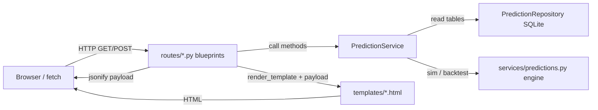

# Routing and Frontend Build Guide

This guide is for building the **HTTP layer** (Flask routes) and **pages** (Jinja templates + light JavaScript) for the Premier League Predictor. It assumes you are new to Flask and explains *why* each piece exists, *what* to implement, and *how* it connects to the rest of the app.

**Related docs (read as one set):**

- [FLASK_BUILD_ROADMAP.md](FLASK_BUILD_ROADMAP.md) — phased delivery (backend → routes → frontend) and non-negotiable architecture rules.
- [BACKEND_DONE_CHECKLIST.md](BACKEND_DONE_CHECKLIST.md) — engine/service fixes and JSON-serialization pitfalls before you rely on routes in production.
- [MIGRATION.md](MIGRATION.md) — repo layout, `python run.py`, and import paths.
- [SERVICE_LAYER_TESTING.md](SERVICE_LAYER_TESTING.md) — how service contracts are tested; extend the same ideas to route tests later.

---

## Part 1 — Flask routing concepts (the “why”)

Think of your app as a **building**: the **URL** is the street address, the **route** is the receptionist who sends visitors to the right room, and the **response** is what they leave with (an HTML page or a JSON document).

### 1.1 What is a route?

| | |
|---|---|
| **WHY** | Browsers and `fetch()` only speak HTTP. Something on the server must map `/api/dashboard` to Python code. |
| **WHAT** | A **route** is a URL pattern + an HTTP method (`GET`, `POST`, …) bound to a **view function** that runs when that URL is requested. |
| **HOW** | In this project, view functions live in blueprints under [`routes/`](../routes/). Example: [`routes/dashboard_routes.py`](../routes/dashboard_routes.py) defines `dashboard_page` for `GET /` and `dashboard_api` for `GET /api/dashboard`. |
| **RESOURCE** | [Flask — Quickstart](https://flask.palletsprojects.com/en/stable/quickstart/) |

### 1.2 Request lifecycle (one click)

| | |
|---|---|
| **WHY** | When something breaks (404, 500, wrong JSON), you debug by walking this path. |
| **WHAT** | Browser sends **request** → WSGI server hands it to Flask → Flask picks the matching route → your view runs → Flask sends **response** (status code + body + headers). |
| **HOW** | Run `python run.py` ([`run.py`](../run.py)); open `http://127.0.0.1:5000/`. Flask calls `create_app()` in [`app_factory.py`](../app_factory.py), which registers blueprints; the first matching route wins. |
| **RESOURCE** | [Flask — The Application Context](https://flask.palletsprojects.com/en/stable/appcontext/) |

### 1.3 Blueprints (feature-sized mini-apps)

| | |
|---|---|
| **WHY** | One giant `app.py` with every URL becomes hard to navigate. Blueprints group related URLs (dashboard, predictions, …). |
| **WHAT** | A **Blueprint** is a bundle of routes registered on the real `Flask` app with `register_blueprint`. |
| **HOW** | See `dashboard_bp = Blueprint("dashboard", __name__)` in [`routes/dashboard_routes.py`](../routes/dashboard_routes.py) (lines 12–13) and registration in [`app_factory.py`](../app_factory.py) (lines 38–41). The first argument (`"dashboard"`) is the **blueprint name** used in `url_for`. |
| **RESOURCE** | [Flask — Blueprints](https://flask.palletsprojects.com/en/stable/blueprints/) |

### 1.4 HTTP methods: GET vs POST

| | |
|---|---|
| **WHY** | GET should be **safe** (no lasting side effects); POST is for **actions** that change state or run heavy work with a body. |
| **WHAT** | **GET** — load a page or read JSON (`@bp.get(...)`). **POST** — submit data (`@bp.post(...)`), e.g. scenario overrides. |
| **HOW** | Compare `@dashboard_bp.get("/")` vs `@predictions_bp.post("/api/scenario")` in [`routes/predictions_routes.py`](../routes/predictions_routes.py) (lines 27–32). |
| **RESOURCE** | [MDN — HTTP request methods](https://developer.mozilla.org/en-US/docs/Web/HTTP/Methods) |

### 1.5 Two ways to respond: HTML vs JSON

| | |
|---|---|
| **WHY** | Same data can power a **server-rendered** page (Jinja) and a **client** (JavaScript `fetch` reading JSON). |
| **WHAT** | `render_template("index.html", **data)` returns HTML. `jsonify(data)` returns `application/json`. |
| **HOW** | Stubs today: `dashboard_page` uses `render_template` without data ([`routes/dashboard_routes.py`](../routes/dashboard_routes.py) lines 15–25); `dashboard_api` returns stub JSON (lines 28–39). You will replace stubs with `PredictionService` output. |
| **RESOURCE** | [Flask — Rendering Templates](https://flask.palletsprojects.com/en/stable/quickstart/#rendering-templates) · [Flask — jsonify](https://flask.palletsprojects.com/en/stable/api/#flask.json.jsonify) |

### 1.6 Where inputs live: path, query string, JSON body

| | |
|---|---|
| **WHY** | You must read inputs from the right place or you will silently get `None` / wrong types. |
| **WHAT** | **Path** — `/team/<name>` (not used much here yet). **Query** — `?simulations=5000&seed=42` → `request.args.get("simulations")` (always **strings**). **JSON body** — POST body → `request.get_json(silent=True)`. |
| **HOW** | Parse query ints with `try/except ValueError` and return HTTP 400 on bad input (see Part 2, R1). |
| **RESOURCE** | [Flask — The Request Object](https://flask.palletsprojects.com/en/stable/api/#flask.Request) |

### 1.7 Accessing the service from a route

| | |
|---|---|
| **WHY** | Routes should not construct DB paths or services by hand every time; the app factory wires one shared instance. |
| **WHAT** | `PredictionService` is stored on the app as `app.config["PREDICTION_SERVICE"]`. |
| **HOW** | In a view: `svc = current_app.config["PREDICTION_SERVICE"]` and `cfg = current_app.config["APP_CONFIG"]` for defaults ([`app_factory.py`](../app_factory.py) lines 32–36). |
| **RESOURCE** | [Flask — Configuration](https://flask.palletsprojects.com/en/stable/config/) |

### 1.8 `url_for` and endpoint names (common gotcha)

| | |
|---|---|
| **WHY** | Hardcoding `href="/predictions"` works until you add a URL prefix or rename a route. `url_for` builds correct URLs. After blueprints, **endpoint** names become `blueprint_name.view_function_name`. |
| **WHAT** | Wrong: `url_for("index")` when no function named `index` is registered. Right: `url_for("dashboard.dashboard_page")` for the home view in [`routes/dashboard_routes.py`](../routes/dashboard_routes.py) (function `dashboard_page` on blueprint `dashboard`). |
| **HOW** | Current nav in [`templates/base.html`](../templates/base.html) uses `url_for('index')`, `url_for('predictions')`, etc. (lines 19, 33–39). Those bare names do not match blueprint endpoints and will raise `BuildError` once the app tries to render the layout. Part 2 (R9) lists the correct replacements. **Scenario:** there is no `/scenario` route in the blueprints yet; either add `GET /scenario` on `predictions_bp` that renders [`templates/scenario.html`](../templates/scenario.html), or point the nav to `url_for('predictions.predictions_page')` with a fragment like `#scenario` after you embed the form on the predictions page. |
| **RESOURCE** | [Flask — url_for](https://flask.palletsprojects.com/en/stable/api/#flask.url_for) |

### 1.9 Status codes and errors

| | |
|---|---|
| **WHY** | Clients (and you) decide what happened from the status code. |
| **WHAT** | **200** OK. **400** bad input (bad query param, invalid JSON, failed validation). **404** unknown URL. **500** unexpected server bug. |
| **HOW** | Raise `werkzeug.exceptions.BadRequest("message")` or `abort(400)` after validation; use `@app.errorhandler` in [`app_factory.py`](../app_factory.py) for consistent JSON errors on `/api/*` (Part 2, R8). Validation in [`services/validators.py`](../services/validators.py) raises `ValueError` — catch at the route boundary and return 400 with the message. |
| **RESOURCE** | [Flask — Handling Application Errors](https://flask.palletsprojects.com/en/stable/errorhandling/) |

### 1.10 Thin routes, fat service (project rule)

| | |
|---|---|
| **WHY** | Keeps Monte Carlo and pandas logic testable without spinning up HTTP. Matches Phase 2 in [FLASK_BUILD_ROADMAP.md](FLASK_BUILD_ROADMAP.md). |
| **WHAT** | Routes: parse inputs, call **one** service method, return `jsonify` / `render_template`. [`services/prediction_service.py`](../services/prediction_service.py) owns orchestration (lines 24–27 describe layers). |
| **HOW** | Do not add simulation math inside `routes/*.py`. If you need a new behavior, add a method on `PredictionService` first, then call it from a route. |
| **RESOURCE** | [FLASK_BUILD_ROADMAP.md §2 Architecture Rules](FLASK_BUILD_ROADMAP.md) |

---

## Part 2 — Routing ship checklist (the “how”)

Each item: **WHY** / **WHAT** / **HOW** / **RESOURCE**. Implement in order where possible (R1 before R2–R7).

### R1 — Helper to read query parameters safely

| | |
|---|---|
| **WHY** | `request.args.get("simulations")` returns a **string** or `None`. `int("abc")` raises `ValueError`; silent defaults must match [`config.AppConfig`](../config.py) (`default_simulations`, `default_seed`). |
| **WHAT** | Small helpers, e.g. `_int_arg(name, default)`, `_optional_int(name)`, used by all GET APIs that accept `simulations` / `seed`. |
| **HOW** | Try `int(value)` inside `try/except`; on failure, `raise BadRequest(f"Invalid {name!r}")` or return `jsonify({"error": ...}), 400`. |
| **RESOURCE** | [Flask — Request.args](https://flask.palletsprojects.com/en/stable/api/#flask.Request.args) |

### R2 — Wire `GET /api/dashboard`

| | |
|---|---|
| **WHY** | Frontend or tools need a stable JSON contract for the dashboard without parsing HTML. |
| **WHAT** | Return `PredictionService.get_dashboard_summary(simulations, seed)` as JSON. Payload shape matches [`DashboardSummary`](../models/contracts.py) (lines 28–33): `last_updated`, `simulation_count`, `title_favorites`, `top_4_race`, `projected_table`. |
| **HOW** | In [`routes/dashboard_routes.py`](../routes/dashboard_routes.py), replace the stub in `dashboard_api` (lines 28–39): read query params with R1 helpers; default `simulations` from `current_app.config["APP_CONFIG"].default_simulations`; call `get_dashboard_summary`; `return jsonify(payload)`. |
| **RESOURCE** | [`services/prediction_service.py`](../services/prediction_service.py) `get_dashboard_summary` (lines 29–84) |

### R3 — Wire `GET /` (dashboard page)

| | | |
|---|---|---|
| **WHY** | Users landing on `/` should see real summary data, not empty template variables. |
| **WHAT** | Same dict as R2, passed into Jinja: `render_template("index.html", **payload)` or explicit keys. |
| **HOW** | Update `dashboard_page` in [`routes/dashboard_routes.py`](../routes/dashboard_routes.py) (lines 15–25). Today [`templates/index.html`](../templates/index.html) expects `columns` / `row_data` (lines 11–23) which the service does not provide — update the template in Part 3 to use `projected_table`, `title_favorites`, etc. |
| **RESOURCE** | [Flask — Context Processors](https://flask.palletsprojects.com/en/stable/templating/#context-processors) (optional, if you want `last_updated` global in nav) |

### R4 — Wire `GET /api/predictions` and `GET /predictions`

| | |
|---|---|
| **WHY** | Detailed probabilities and confidence intervals power the predictions page and any JS charts. |
| **WHAT** | Call `get_detailed_predictions(simulations, seed)`; returns dict with `meta`, `projected_table`, `probabilities` (`title`, `top2`, `top4`, `relegation`), `confidence_intervals` ([`services/prediction_service.py`](../services/prediction_service.py) lines 86–143). |
| **HOW** | In [`routes/predictions_routes.py`](../routes/predictions_routes.py): `predictions_api` → `jsonify(payload)`; `predictions_page` → `render_template("predictions.html", **payload)` (lines 11–24). |
| **RESOURCE** | [SERVICE_LAYER_TESTING.md](SERVICE_LAYER_TESTING.md) — contract-style assertions you can mirror in route tests |

### R5 — Wire `GET /api/fixtures` and `GET /fixtures`

| | |
|---|---|
| **WHY** | Fixtures list is read-only; same pattern as dashboard. |
| **WHAT** | `get_upcoming_fixtures()` returns a **list** of dicts with keys: `match_date`, `home_team`, `away_team`, `home_win_prob`, `away_win_prob`, `expected_home_goals`, `expected_away_goals` ([`services/prediction_service.py`](../services/prediction_service.py) lines 145–162). |
| **HOW** | Prefer `jsonify({"fixtures": rows})` so the top-level JSON is an **object** (easier to extend with `meta` later). `fixtures_page`: pass `fixtures=rows` into [`templates/fixtures.html`](../templates/fixtures.html). |
| **RESOURCE** | [Flask — jsonify](https://flask.palletsprojects.com/en/stable/api/#flask.json.jsonify) |

### R6 — Wire `GET /api/accuracy` and `GET /accuracy`

| | |
|---|---|
| **WHY** | Accuracy metrics are parameterized by season and gameweek. |
| **WHAT** | `get_accuracy_tracking(season: str, at_gameweek: int, checkpoints: list[int])` ([`services/prediction_service.py`](../services/prediction_service.py) lines 254–271). Response includes `meta`, `latest`, `trend`, `team_error_profile`, `freshness`. |
| **HOW** | Read `season` (string, e.g. `"2024"`), `at_gameweek` (int), `checkpoints` from query as CSV: `?checkpoints=10,20,30,38` → split, strip, `int` each. On parse errors, 400. Wire [`routes/accuracy_routes.py`](../routes/accuracy_routes.py) (lines 11–24). |
| **RESOURCE** | [BACKEND_DONE_CHECKLIST.md §B3](BACKEND_DONE_CHECKLIST.md) — keep payloads JSON-serializable (`datetime` → ISO string, no accidental set-wrapping of lists) |

### R7 — Wire `POST /api/scenario`

| | |
|---|---|
| **WHY** | Scenario overrides are supplied in the **body**, not the query string. |
| **WHAT** | JSON body like `{"overrides": [{"home": "...", "away": "...", "result": "home_win"}], "simulations": 5000, "seed": 0}`. Call `run_scenario(overrides, simulations, seed)` ([`services/prediction_service.py`](../services/prediction_service.py) lines 164–252). Response includes `meta`, `overrides`, `baseline`, `scenario`, `comparison` (with keys `title`, `top_4`, `top_2`, `relegation`). |
| **HOW** | `body = request.get_json(silent=True)`; if `body is None`, 400. Require `overrides` list (may be empty for baseline-only checks). Merge `simulations` / `seed` from body or query. `try/except ValueError as e` from [`validate_fixture_override`](../services/validators.py) (lines 19–36) → 400 JSON `{"error": str(e)}`. |
| **RESOURCE** | [Flask — get_json](https://flask.palletsprojects.com/en/stable/api/#flask.Request.get_json) |

### R8 — Global error handlers in `create_app`

| | |
|---|---|
| **WHY** | Unhandled exceptions become generic HTML 500 pages; API clients need JSON. |
| **WHAT** | Register `@app.errorhandler(ValueError)`, `@app.errorhandler(BadRequest)`, optional catch-all for 500. If `request.path.startswith("/api/")`, return `jsonify({"error": ...})` with appropriate status. |
| **HOW** | Add handlers **inside** `create_app` after `app` is created in [`app_factory.py`](../app_factory.py) (before `return app`, after line 31). |
| **RESOURCE** | [Flask — Registering Handlers](https://flask.palletsprojects.com/en/stable/errorhandling/#registering) |

### R9 — Fix `url_for` in the base layout

| | |
|---|---|
| **WHY** | Blueprint endpoint names are `blueprint.view_function`, not bare `index` / `predictions`. |
| **WHAT** | Replace nav hrefs in [`templates/base.html`](../templates/base.html). |
| **HOW** | Suggested mapping (verify with `flask routes` after wiring): |

| Current (broken with blueprints) | Replace with |
|-----------------------------------|----------------|
| `url_for('index')` | `url_for('dashboard.dashboard_page')` |
| `url_for('predictions')` | `url_for('predictions.predictions_page')` |
| `url_for('scenario')` | Add `GET /scenario` route **or** `url_for('predictions.predictions_page') ~ '#scenario'` |
| `url_for('accuracy')` | `url_for('accuracy.accuracy_page')` |

Add a Fixtures link: `url_for('fixtures.fixtures_page')` (there is no nav entry today).

| **RESOURCE** | [Flask — url_for with Blueprints](https://flask.palletsprojects.com/en/stable/blueprints/#building-urls) |

### R10 — Smoke test checklist

| | |
|---|---|
| **WHY** | Confirms each layer returns the shape your templates and JS expect. |
| **WHAT** | Manual: open each page in a browser. Optional: `curl` each `/api/*`. |
| **HOW** | |

- `GET /` — 200, HTML shows `last_updated`, table/cards from service.
- `GET /api/dashboard` — 200, JSON keys match [`DashboardSummary`](../models/contracts.py).
- `GET /predictions`, `GET /api/predictions` — 200, keys `meta`, `projected_table`, `probabilities`, `confidence_intervals`.
- `GET /fixtures`, `GET /api/fixtures` — 200, `fixtures` array with stable keys (R5).
- `GET /accuracy`, `GET /api/accuracy` — 200, `json.dumps` succeeds (see [BACKEND_DONE_CHECKLIST.md §E](BACKEND_DONE_CHECKLIST.md)).
- `POST /api/scenario` with valid body — 200, `comparison` present; invalid team — 400.

| **RESOURCE** | [Flask CLI — routes](https://flask.palletsprojects.com/en/stable/cli/#routes) |

### R11 — Optional: caching expensive simulations

| | |
|---|---|
| **WHY** | `simulate_season` / `get_team_probabilities` can be slow; repeated identical requests waste CPU. |
| **WHAT** | Short TTL cache keyed by `(endpoint, simulations, seed, …)` or `flask-caching`. |
| **HOW** | Defer until core wiring works; document cache invalidation when DB updates. |
| **RESOURCE** | [Flask-Caching](https://flask-caching.readthedocs.io/) (third-party) |

### Part 2 — Troubleshooting

| Symptom | Likely cause | Fix |
|---------|----------------|-----|
| `TemplateNotFound` | Wrong `template_folder` | [`app_factory.py`](../app_factory.py) line 31 sets `templates` next to project root |
| `BuildError: Could not build url for endpoint` | Wrong `url_for` name | Use R9 table; run `flask routes` |
| `TypeError: Object of type X is not JSON serializable` | Non-JSON types in dict | Fix in service (see [BACKEND_DONE_CHECKLIST.md §B3](BACKEND_DONE_CHECKLIST.md)) |
| Empty `columns` / `row_data` on dashboard | Template not updated | Part 3 F2 — switch to `projected_table` / service keys |

---

## Part 3 — Frontend ship checklist (the “look”)

### F0 — Jinja2 in five minutes

| | |
|---|---|
| **WHY** | Server-rendered pages are HTML built from Python data without a separate build step. |
| **WHAT** | `{{ variable }}` prints escaped text. `...`, `...`. Filters: `{{ value|round(1) }}`. |
| **HOW** | Example: loop `projected_table` rows with `row.team`, `row.points`, `row.position` once R3 passes that data. Replace the `columns` / `row_data` pattern in [`templates/index.html`](../templates/index.html) (lines 11–23). |
| **RESOURCE** | [Jinja2 — Template Designer Documentation](https://jinja.palletsprojects.com/en/stable/templates/) |

### F1 — Static assets

| | |
|---|---|
| **WHY** | CSS/JS/images are served from `/static/...` by Flask when a `static/` folder exists beside the app. |
| **WHAT** | [`templates/base.html`](../templates/base.html) line 9 links `url_for('static', filename='styles.css')`. |
| **HOW** | Ensure `static/styles.css` exists **or** change `filename` to match your tree (e.g. `css/app.css` under [`static/`](../static/)). Add `static/js/predictions.js` for scenario `fetch` if you prefer not to inline scripts. |
| **RESOURCE** | [Flask — Static Files](https://flask.palletsprojects.com/en/stable/quickstart/#static-files) |

### F2 — Dashboard page (server-rendered first)

| | |
|---|---|
| **WHY** | Delivers value without JavaScript; matches Phase 3 dashboard bullets in [FLASK_BUILD_ROADMAP.md](FLASK_BUILD_ROADMAP.md). |
| **WHAT** | Hero area: `simulation_count`, `last_updated`. Table from `projected_table`. Cards from `title_favorites` and `top_4_race` (each row: `team`, `title_probability`, `top_4_probability` — show as percentages in template if desired). |
| **HOW** | Edit [`templates/index.html`](../templates/index.html); use Bootstrap `card`, `table`, `row`/`col` from base layout. |
| **RESOURCE** | [Bootstrap 5 — Cards / Tables](https://getbootstrap.com/docs/5.3/components/card/) |

### F3 — Predictions page

| | |
|---|---|
| **WHY** | Users see full probability breakdowns and intervals. |
| **WHAT** | Render `probabilities.title`, `.top4`, `.top2`, `.relegation` (dict team → percent), `confidence_intervals` list (`team`, `median`, `p5`, `p95`), `projected_table`. |
| **HOW** | Expand [`templates/predictions.html`](../templates/predictions.html); consider sortable tables or tabs per metric. |
| **RESOURCE** | Same Jinja + Bootstrap as F2 |

### F4 — Fixtures page

| | |
|---|---|
| **WHY** | Upcoming matches with model outputs in one place. |
| **WHAT** | Loop `fixtures`: show date, home vs away, `home_win_prob` / `away_win_prob` (add draw if your data adds it later), `expected_home_goals` / `expected_away_goals`. |
| **HOW** | Replace placeholder copy in [`templates/fixtures.html`](../templates/fixtures.html) (lines 1–11). |
| **RESOURCE** | [Bootstrap — Progress](https://getbootstrap.com/docs/5.3/components/progress/) for probability bars |

### F5 — Accuracy page

| | |
|---|---|
| **WHY** | Explains model quality (roadmap Phase 3 accuracy section). |
| **WHAT** | `latest` (backtest summary — structure from engine), `trend`, `team_error_profile`, `freshness`, `meta`. |
| **HOW** | Expand [`templates/accuracy.html`](../templates/accuracy.html); add a short glossary block for metric names (MAE, hit counts, etc.). |
| **RESOURCE** | [BACKEND_DONE_CHECKLIST.md](BACKEND_DONE_CHECKLIST.md) for metric naming consistency |

### F6 — Scenario form + `fetch`

| | |
|---|---|
| **WHY** | Ties together POST, JSON body, and dynamic DOM updates (the full request cycle from Part 1). |
| **WHAT** | Form fields: home team, away team, result (`home_win` / `draw` / `away_win`). Button triggers `fetch('/api/scenario', { method: 'POST', headers: { 'Content-Type': 'application/json' }, body: JSON.stringify({ overrides: [{ home, away, result }], simulations, seed }) })`. |
| **HOW** | Implement on [`templates/predictions.html`](../templates/predictions.html) or dedicated [`templates/scenario.html`](../templates/scenario.html) with ``. Parse JSON; on success, render `data.comparison.title` (and other buckets) into a `<table>`; on 400, show `data.error` or `detail`. |
| **RESOURCE** | [MDN — fetch](https://developer.mozilla.org/en-US/docs/Web/API/Fetch_API/Using_Fetch) |

### F7 — Progressive enhancement

| | |
|---|---|
| **WHY** | Ship readable pages first; add interactivity where it pays off. |
| **WHAT** | **A** — All pages work with server data only. **B** — Optional “Refresh” button calling `GET /api/dashboard`. **C** — Charts (Chart.js from CDN) using `confidence_intervals` or histogram data from API. |
| **HOW** | Add Chart.js only after table views are correct. |
| **RESOURCE** | [Chart.js — Getting Started](https://www.chartjs.org/docs/latest/getting-started/) |

### F8 — Styling pass

| | |
|---|---|
| **WHY** | Consistent spacing and hierarchy reduce cognitive load. |
| **WHAT** | Bootstrap already loaded in [`templates/base.html`](../templates/base.html) (lines 8–9, 55). Use `container` or `container-fluid`, `row` / `col-*`, `card`, `table table-striped`. |
| **HOW** | Override in `static/styles.css` (or `static/css/...`) for brand tweaks. |
| **RESOURCE** | [Bootstrap — Layout](https://getbootstrap.com/docs/5.3/layout/grid/) |

### F9 — UI smoke tests

| | |
|---|---|
| **WHY** | Catches broken nav, CORS-less same-origin `fetch` mistakes, and empty states. |
| **WHAT** | Click every nav link; submit scenario with valid and invalid teams; confirm no console errors. |
| **HOW** | Checklist: Home → Predictions → Fixtures → Accuracy; `fetch` network tab shows 200/400 as expected. |
| **RESOURCE** | Browser DevTools Network tab (no external doc required) |

---

## Glossary

| Term | Meaning |
|------|---------|
| **WSGI** | Protocol between Python web apps and servers (how Flask receives HTTP). |
| **Blueprint** | Named group of routes registered on the app. |
| **View function** | Python function handling one route + method. |
| **Endpoint** | Name Flask uses for `url_for`, often `blueprint.view_function`. |
| **Jinja2** | Flask’s default templating language for HTML. |
| **Payload / contract** | Stable dict shape (see [`models/contracts.py`](../models/contracts.py)) between service, routes, and templates. |

---

## Official reading list

| Topic | URL |
|-------|-----|
| Flask quickstart | https://flask.palletsprojects.com/en/stable/quickstart/ |
| Blueprints | https://flask.palletsprojects.com/en/stable/blueprints/ |
| Request object | https://flask.palletsprojects.com/en/stable/api/#flask.Request |
| jsonify | https://flask.palletsprojects.com/en/stable/api/#flask.json.jsonify |
| Error handling | https://flask.palletsprojects.com/en/stable/errorhandling/ |
| Jinja2 templates | https://jinja.palletsprojects.com/en/stable/templates/ |
| MDN fetch | https://developer.mozilla.org/en-US/docs/Web/API/Fetch_API/Using_Fetch |
| MDN HTTP methods | https://developer.mozilla.org/en-US/docs/Web/HTTP/Methods |

---

## What “done” looks like (aligned with the roadmap)

From [FLASK_BUILD_ROADMAP.md](FLASK_BUILD_ROADMAP.md):

**Phase 2 — API and route layer**

- Every page route (`/`, `/predictions`, `/fixtures`, `/accuracy`) renders with **real** data from `PredictionService`.
- Every API route (`/api/dashboard`, `/api/predictions`, `/api/fixtures`, `/api/scenario`, `/api/accuracy`) returns **predictable JSON**.
- Errors return **correct status codes** and messages (400 for bad input).

**Phase 3 — Frontend integration**

- Three to four pages render from **live** contracts (not stubs).
- User can run a **scenario** from the UI (F6).
- Accuracy page **communicates** model quality clearly (F5 + short glossary).

When those bullets are true, routing and the initial frontend pass are **shipped** for this milestone; iterate on UX (F7–F8) afterward.

---

_End of guide._
